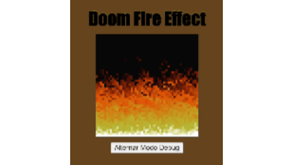

# 🔥 Doom Fire Effect

Projeto desenvolvido durante uma aula com o objetivo de estudar, de forma prática e visual, conceitos fundamentais de **sistemas de coordenadas, arrays, matrizes, sistemas de cores e manipulação do DOM** utilizando JavaScript.

A ideia do projeto é reproduzir o famoso efeito de fogo do jogo **Doom**, representando cada pixel do fogo através de uma posição dentro de um array e utilizando uma paleta de cores para transformar os valores de intensidade em uma imagem.

---
<p align="center">
  
</p>

---

# 🎯 Objetivos do projeto

Durante o desenvolvimento deste projeto, são trabalhados principalmente os seguintes conceitos:
* Entender como um **array unidimensional** pode representar uma estrutura semelhante a uma matriz.
* Compreender **sistemas de coordenadas**, trabalhando com linhas, colunas e índices.
* Entender como uma imagem pode ser formada a partir de pequenos elementos, como pixels.
* Trabalhar com o **sistema de cores RGB**.
* Utilizar uma **paleta de cores** para representar diferentes intensidades.
* Manipular elementos HTML através do **JavaScript**.
* Entender como alterações nos dados podem gerar uma animação visual.
* Utilizar números aleatórios para criar variações no comportamento do fogo.
* Criar um modo de **debug** para visualizar os índices e valores utilizados pelo algoritmo.

# 🎥 Referências
## Vídeo

O projeto foi desenvolvido com base na explicação apresentada no vídeo:
[Implementei o algoritmo de Fogo do DOOM (muito fácil)](https://youtu.be/HCjDjsHPOco?si=L7CAf4duGWimKvhu)

## Repositório original
O código também utiliza como referência o projeto original desenvolvido por Filipe Deschamps: [doom-fire-algorithm](https://github.com/filipedeschamps/doom-fire-algorithm?utm_source=chatgpt.com)

# 🧠 Como funciona

O efeito é construído a partir de uma estrutura de dados que representa todos os pixels da tela.

Neste projeto, a área do fogo possui inicialmente:
```js
let larguraFogo = 50;
let alturaFogo = 50;
```

Isso significa que temos uma matriz visual de:

**50 × 50 = 2500 pixels**

Porém, em vez de utilizar uma matriz bidimensional, o projeto utiliza um **array unidimensional**:
```js
const arrayPixelsFogo = [];
```

Cada posição desse array representa um pixel da imagem.

# 📐 Sistema de coordenadas

Para descobrir a posição de um pixel dentro do array, utilizamos a seguinte fórmula:
```js
const indexPixel = coluna + larguraFogo * linha;
```

Por exemplo, considerando uma largura de 50:
```
Linha 0:
0   1   2   3   4   ... 49

Linha 1:
50  51  52  53  54  ... 99

Linha 2:
100 101 102 103 104 ... 149
```

Dessa forma, conseguimos transformar uma coordenada `(linha, coluna)` em um único índice dentro do array.

Esse conceito é importante para entender como estruturas bidimensionais podem ser representadas em uma estrutura unidimensional.

# 🎨 Sistema de cores

Cada pixel possui uma intensidade de fogo, representada por um número.

Essa intensidade é utilizada como índice para acessar a paleta:
```js
const cor = paletaCoresFogo[intensidadeFogo];
```

A paleta contém valores RGB:
```js
{ r: 255, g: 255, b: 255 }
```

Esses valores representam:
* `r` → Red (vermelho)
* `g` → Green (verde)
* `b` → Blue (azul)

O JavaScript transforma esses valores em uma cor CSS:
```js
rgb(255, 255, 255)
```

Assim, podemos ter diferentes intensidades representadas por diferentes cores.

No fogo, as cores vão aproximadamente de tons escuros até tons mais claros:
```
⬛ Preto
🟥 Vermelho escuro
🟧 Vermelho / laranja
🟨 Amarelo
⬜ Branco
```

# 🔥 Formação do fogo

O fogo começa com uma base localizada na última linha da matriz.

Essa base recebe a maior intensidade da paleta:
```js
function criarBaseFogo() {
  for (let coluna = 0; coluna <= larguraFogo; coluna++) {
    const transbordoIndexPixel = larguraFogo * alturaFogo;
    const indexPixel = transbordoIndexPixel - larguraFogo + coluna;

    arrayPixelsFogo[indexPixel] = 36;
  }
}
```

A partir dessa base, o algoritmo calcula como a intensidade deve se propagar para os pixels acima.

A cada atualização, a intensidade do fogo sofre um pequeno **decaimento aleatório**:
```js
const decaimento = Math.floor(Math.random() * 3);
```

Isso faz com que o fogo não seja completamente uniforme, criando a aparência de movimento.

# 🔄 Propagação

A função responsável pela propagação é:
```js
calcularPropagacaoFogo()
```

Ela percorre todos os pixels:
```js
for (let coluna = 0; coluna < larguraFogo; coluna++) {
  for (let linha = 0; linha < alturaFogo; linha++) {
    const indexPixel = coluna + larguraFogo * linha;
    atualizarIntensidadeFogoPorPixel(indexPixel);
  }
}
```

Para cada pixel, o algoritmo verifica o pixel que está abaixo dele:
```js
const indexPixelAbaixo = indexPixelAtual + larguraFogo;
```

Como cada linha possui `larguraFogo` elementos, somar a largura ao índice significa avançar exatamente uma linha na matriz.

Exemplo:
```
0   1   2   3   4
5   6   7   8   9
10  11  12  13  14
```

Se estamos no índice `2`:
```
2 + 5 = 7
```

Ou seja, o pixel abaixo de `2` é o pixel `7`.

# 🎲 Decaimento aleatório

Depois de encontrar o pixel abaixo, o algoritmo aplica um decaimento:
```js
const novaIntensidadeFogo =
  intensidadeFogoPixelAbaixo - decaimento >= 0
    ? intensidadeFogoPixelAbaixo - decaimento
    : 0;
```

Isso faz com que a intensidade diminua conforme o fogo sobe.

Como o decaimento é aleatório, cada atualização pode produzir um resultado diferente, criando a sensação de uma chama se movimentando.

# 🖥️ Renderização

Depois que os valores do array são atualizados, o projeto transforma esses dados em elementos HTML.

A função responsável por isso é:
```js
renderizarFogo()
```

Ela cria uma tabela HTML:
```js
<table>
  <tr>
    <td></td>
    <td></td>
    <td></td>
  </tr>
</table>
```

Cada **`<td>`** representa um pixel.

No modo normal, a cor do pixel é aplicada através do CSS:
```js
<td
  class="pixel"
  style="background-color: rgb(...)" >
</td>
```

Dessa forma, uma grande quantidade de pequenos elementos HTML forma visualmente a imagem do fogo.

# 🐞 Modo Debug

O projeto possui um modo de debug que pode ser ativado através do botão:
```js
<button onclick="alternarModoDebug()">
  Alternar Modo Debug
</button>
```

Quando o modo debug está ativo, a resolução é reduzida:
```js
larguraFogo = 16;
alturaFogo = 16;
```

Em vez de mostrar apenas as cores, cada célula passa a apresentar:
* Índice do pixel.
* Intensidade do fogo.
* Cor correspondente à intensidade.

Isso facilita a visualização do funcionamento do algoritmo e ajuda a entender a relação entre:
```
linha + coluna
      ↓
    índice
      ↓
 intensidade
      ↓
     cor
      ↓
   pixel
```

# 📁 Estrutura do projeto

A estrutura esperada do projeto é:
```
.
├── index.html
├── script.js
└── README.md
```

## `index.html`
Responsável pela estrutura da página, incluindo:
* Título.
* Área onde o fogo será renderizado.
* Botão para alternar o modo debug.
* Estilos CSS básicos.

## `script.js`
Contém toda a lógica do projeto:
* Criação do array de pixels.
* Criação da base do fogo.
* Cálculo da propagação.
* Aplicação do decaimento.
* Conversão da intensidade em cor.
* Renderização dos pixels.
* Controle do modo debug.

# ▶️ Como executar

Não é necessário instalar dependências ou utilizar um servidor específico.

Basta clonar ou baixar o projeto e abrir o arquivo:
```
index.html
```
no navegador.

O JavaScript será carregado automaticamente através de:
```js
<script src="script.js"></script>
```
Após abrir a página, o efeito será iniciado automaticamente.

# ⏱️ Atualização da animação

A animação é atualizada a cada **50ms**:
```js
setInterval(calcularPropagacaoFogo, 50);
```

Isso significa que o algoritmo calcula e renderiza uma nova versão do fogo aproximadamente **20 vezes por segundo**.

A sequência é basicamente:
```
Array de pixels
      ↓
Calcula propagação
      ↓
Aplica decaimento
      ↓
Atualiza intensidades
      ↓
Renderiza HTML
      ↓
Imagem do fogo
      ↓
Repete
```

# 📚 Conceitos estudados

Este projeto é especialmente interessante para estudar:
* Arrays.
* Matrizes.
* Índices.
* Coordenadas.
* RGB.
* Manipulação do DOM.
* Estruturas de repetição.
* Funções.
* `setInterval`.
* `Math.random()`.
* Operações matemáticas.
* Renderização de elementos HTML.
* Animação baseada em atualização de estado.

# 💡 O principal aprendizado

Apesar de visualmente parecer apenas um efeito de fogo, o projeto demonstra um conceito bastante importante:

> Uma imagem pode ser representada como uma coleção de valores, onde cada valor possui uma posição e uma informação visual associada.

Neste caso:
```
Índice → Intensidade → Cor → Pixel
```

Ao atualizar esses valores continuamente, conseguimos criar uma animação sem precisar armazenar uma sequência de imagens.

Isso ajuda a criar uma ponte entre conceitos matemáticos, estruturas de dados e computação gráfica.

# 📝 Observação

Este projeto possui finalidade educacional e foi desenvolvido durante uma aula, utilizando como referência o material disponibilizado por [Filipe Deschamps no projeto doom-fire-algorithm](https://github.com/filipedeschamps/doom-fire-algorithm?utm_source=chatgpt.com).
